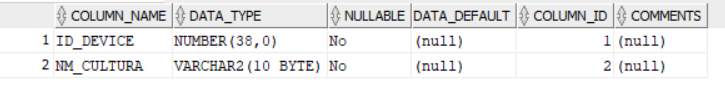
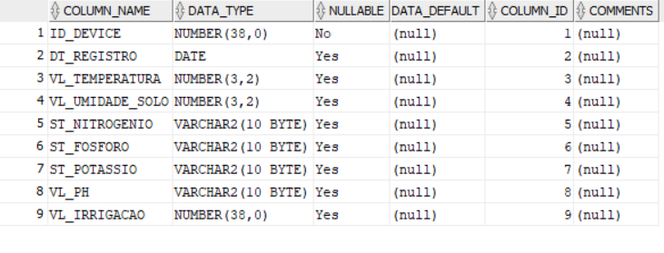
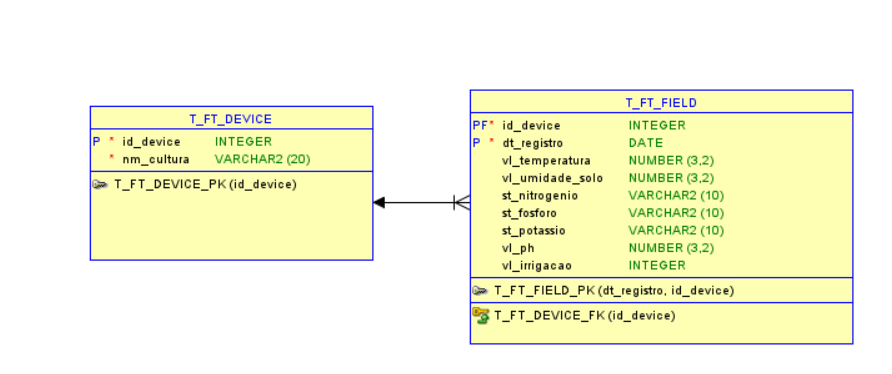
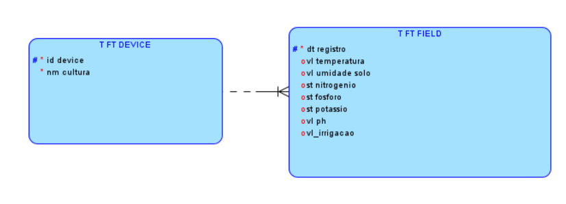
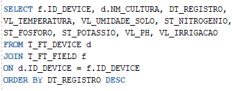
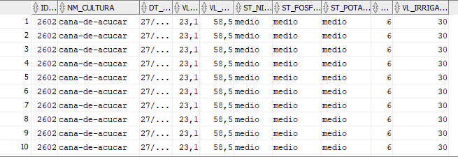
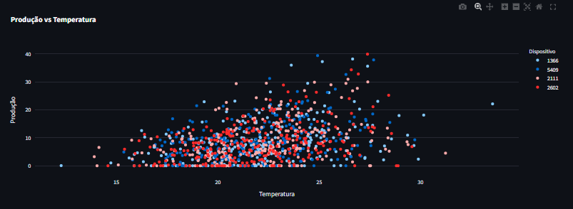
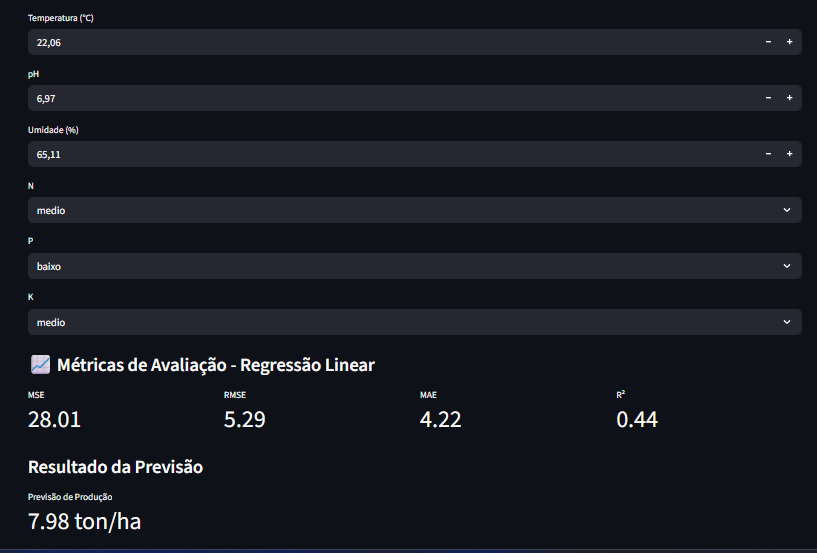

# FIAP - Faculdade de Informática e Administração Paulista

 

# FarmTech Solution - IoT Device

## Nome do grupo: Grupo 13

##  Integrantes: 
- <a href="https://www.linkedin.com/in/leon-gonzalez-8701b9199/">Pablo Leon Dimauro Gonzalez</a>
- <a href=“https://www.linkedin.com/in/jo%C3%A3o-nishikawa-1ba660263”>João Pedro Nishikawa Alves</a>
- Gustavo Trindade Soares
- Rafael Brites Pereira
- Leonardo de Mattos Oliveira
- Gabriela de Andrade Alves

##  Professores:
### Tutor(a) 
- Ana Cristina Santos</a>
### Coordenador(a)
- <a href="https://www.linkedin.com/in/andregodoichiovato/">André Godoi</a>

## Descrição

Nesta fase do projeto, realizamos a modelagem do banco de dados, implementação de de modelo simples de aprendizado supervisionado de regressão e prevemos quanto será a produção se os valores forem mantidos.

### Banco de Dados

Decidimos organizar o banco em 2 tabelas, T_FT_DEVICE e T_FT_FIELD, conforme mostradas abaixo:

 T_FT_DEVICE:

T_FT_FIELD:

Podemos verificar o modelo relacional do banco a seguir:

E o modelo logico:

A informação completa é obtido ao realizarmos uma query onde juntamos as duas tabelas, de cardinalidade 1:N, com base no id_device:

Query usada:

Resposta do banco:

### Integrando ML com StreamLit

Antes de iniciarmos o treinamento do modelo, fizemos uma analise exploratoria, onde verificamos que nao temos valores nulos e nem outliers significativos. Tambem podemos ver outras informações e relações, como:

Onde podemos observar a relação entre temperatura e produção para cada dispositivo cadastrado.

A integração do aprendizado de maquina com streamlit foi simples, onde coletamos os valores para cada atributo e inserimos no modelo, que retorna a quantidade de produção para aqueles valores.

Video onde explico sobre o banco de dados:https://www.youtube.com/watch?v=riX_RoYZSHk

Video onde explico sobre integração ML + Streamlit (Parte 1): https://www.youtube.com/watch?v=JEhMSjU5spc

Video onde explico sobre treinamento do modelo, previsoes e desempenho (Parte 2): https://www.youtube.com/watch?v=tqiL5Qx-GvI

## Bibliotecas utilizadas

* **Pandas**: Visualização e manipulação de tabelas
* **Numpy**: Utilizada na metrica RMSE e na geração dos dados simulados (scripts/database/datageneration.py)
* **SckitLearn**: Usada para treinamento, previsão e avaliação do modelo de aprendizagem de maquina
* **Paho_mqtt**: Possibilita a comunicação MQTT de maneira mais pratica
* **Oracledb**: Usado para realizar as operações no banco de dados oracle.
* **Streamlit**: Responsável pela criação da interface web com python, onde podemos visualizar os resultados obtidos.

## Estrutura de pastas

Dentre os arquivos e pastas presentes na raiz do projeto, definem-se:

- <b>assets</b>: aqui estão os arquivos de imagem para a elaboração deste arquivo.

- <b>scripts</b>: Codigo em Python, realiza operações no banco de dados, comunicação MQTT, consultas a API e geração de alertas com base nos dados recebidos e geração de interfaces e paginas com streamlit.

- <b>src</b>: Código criado para funcionamento do ESP32.
  
- <b>README.md</b>: Este mesmo arquivo, onde é descrito todo o projeto.

## 🗃 Histórico de lançamentos

* 0.1.1 - 27/11/25
* 0.1.0 - 14/10/25

## 📋 Licença

<a property="dct:title" rel="cc:attributionURL" href="https://github.com/agodoi/template">MODELO GIT FIAP</a> por <a rel="cc:attributionURL dct:creator" property="cc:attributionName" href="https://fiap.com.br">Fiap</a> está licenciado sobre <a href="http://creativecommons.org/licenses/by/4.0/?ref=chooser-v1" target="_blank" rel="license noopener noreferrer" style="display:inline-block;">Attribution 4.0 International</a>.

